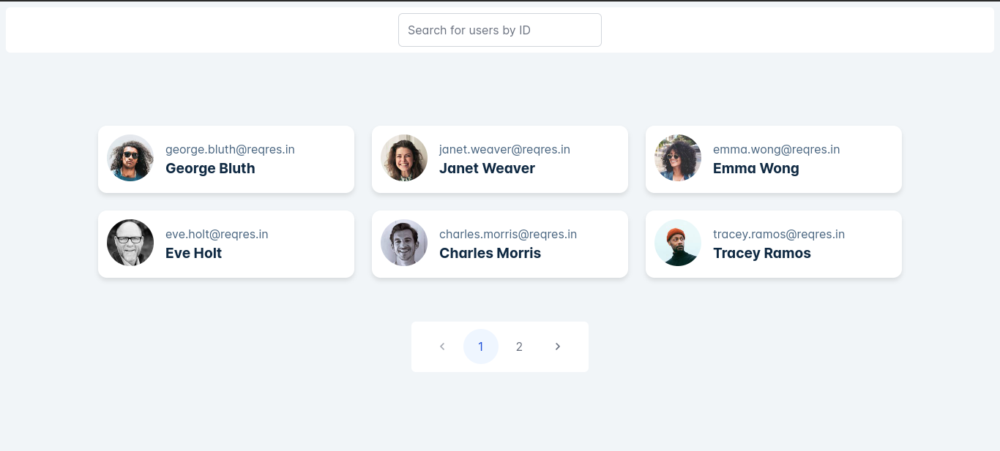
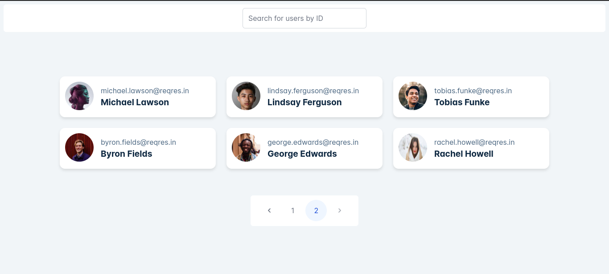
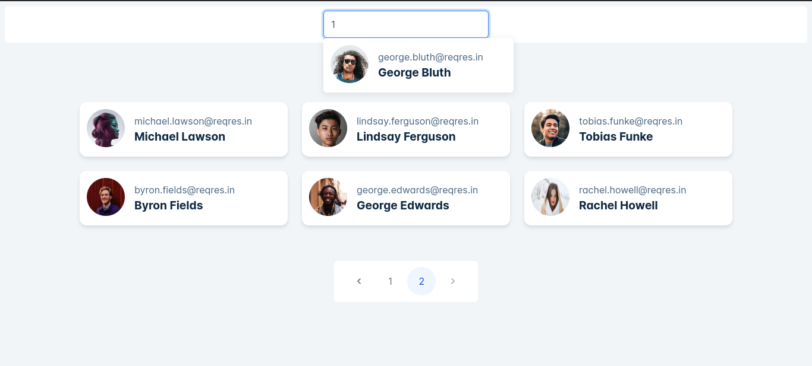
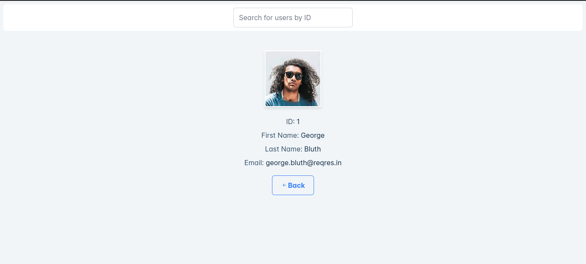

# User Management System

## Description

This project is an Angular application that provides a user management system. It fetches user data from an external API, allows users to search for specific users by their ID, view detailed information about individual users, and navigate between pages.

## Table of Contents

0. [Screenshot](#screenshot)
1. [Introduction](#introduction)
2. [Features](#features)
3. [Demo](#demo)
4. [Installation](#installation)
5. [Usage](#usage)
6. [Technologies Used](#technologies-used)
7. [API Used](#api-used)

## screenshot

## Introduction

This App provides functionalities for displaying user lists, searching for users, viewing user details, and navigating between pages.

## Features

- Display a paginated list of users fetched from the API.
- View detailed information about individual users by clicking on their cards.
- Search for users by their ID using an instant search field in the header.
- Navigate between pages using pagination.
- Provide a loading bar or spinner to indicate pending network requests.

## Demo

This is project demo link:

[Demo Link](https://users-psi-woad.vercel.app/)

## Installation

1. Clone the repository: `git clone https://github.com/AhmedSalah8/users`
2. Navigate to the project directory: `cd project`
3. Install dependencies: `npm install`

## Usage

1. Run the development server: `ng serve`
2. Open your web browser and navigate to `http://localhost:4200/` to view the application.

## Technologies Used

List of technologies and libraries/frameworks used in this project.

- Angular 17.3.0
- Angular CLI
- PrimeNG
- Bootstrap Icons

## API Used

This project fetches user data from the [ReqRes.in API](https://reqres.in/).
